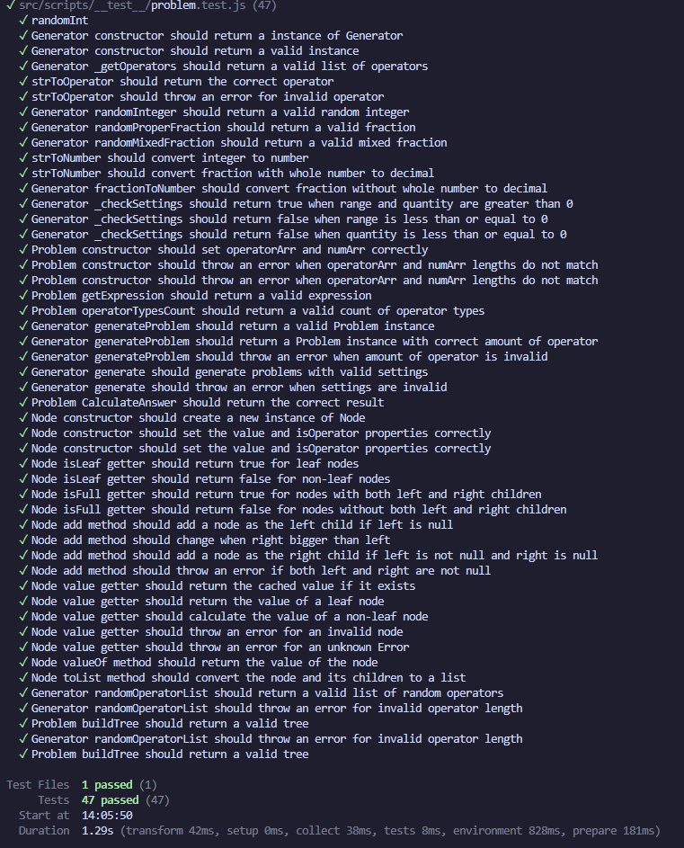
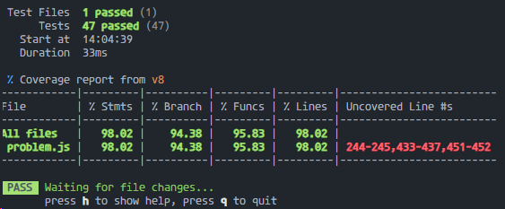

# 结对项目

| 这个作业属于哪个课程 | [首页 - 软件工程2024 - 广东工业大学 - 班级博客 - 博客园 (cnblogs.com)](https://edu.cnblogs.com/campus/gdgy/SoftwareEngineering2024/)           |
| -------------------- | ---------------------------------------------------------------------------------------------------------------------------------------------- |
| 这个作业要求在哪里   | [结对项目 - 作业 - 软件工程2024 - 班级博客 - 博客园 (cnblogs.com)](https://edu.cnblogs.com/campus/gdgy/SoftwareEngineering2024/homework/13137) |
| 这个作业的目标       | 两人合作完成一个自动生成小学四则运算题目的项目                                                                                                 |

| 项目成员 | 学号       |
| -------- | ---------- |
| 李宇康   | 3122004871 |
| 梁丽贤   | 3222004639 |

GitHub地址：[catnaut/FrameworkFiesta-math-problem-gen: FrameworkFiesta :D (github.com)](https://github.com/catnaut/FrameworkFiesta-math-problem-gen)


## 一、PSP表

| **PSP2.1**                              | **Personal Software Process Stages**    | **预估耗时（分钟）** | **实际耗时（分钟）** |
| --------------------------------------- | --------------------------------------- | -------------------- | -------------------- |
| Planning                                | 计划                                    | 20                   |                      |
| · Estimate                              | · 估计这个任务需要多少时间              | 10                   |                      |
| Development                             | 开发                                    | 2015                 |                      |
| · Analysis                              | · 需求分析 (包括学习新技术)             | 120                  |                      |
| · Design Spec                           | · 生成设计文档                          | 20                   | 10                   |
| · Design Review                         | · 设计复审                              | 0                    |                      |
| · Coding Standard                       | · 代码规范 (为目前的开发制定合适的规范) | 15                   | 14                   |
| · Design                                | · 具体设计                              | 60                   | 40                   |
| · Coding                                | · 具体编码                              | 1200                 |                      |
| · Code Review                           | · 代码复审                              | 120                  |                      |
| · Test                                  | · 测试（自我测试，修改代码，提交修改）  | 480                  |                      |
| Reporting                               | 报告                                    | 90                   |                      |
| · Test Repor                            | · 测试报告                              | 30                   |                      |
| · Size Measurement                      | · 计算工作量                            | 30                   |                      |
| · Postmortem & Process Improvement Plan | · 事后总结, 并提出过程改进计划          | 30                   |                      |
|                                         | ·  合计                                 | 2125                 |                      |


## 二、性能分析

将生成题目的算法进行了改进，使用二叉树进行题目生成


## 三、设计实现过程

### 算法说明

#### 流程

  1. 通过随机数生成题目
  2. 构建 AST 来检验 题目是否有出现复数，会不会出现除数为 0
  3. 插入 JavaScript Set 集合内，实现不重复

#### 随机数生成题目

生成题目，随机生成 数字 ，运算符，直接组合为一个表达式（中缀表达式）

#### 后缀表达式 RPN

利用栈，将中缀表达式转化为后缀表达式，计算  AST

> 逆波兰表示法（英语：Reverse Polish notation，缩写RPN，或逆波兰记法、逆卢卡西维茨记法），是一种由波兰数学家扬·卢卡西维茨于1920年引入的数学表达式形式。**逆波兰记法不需要括号来标识操作符的优先级**
中缀表达式 `3 + 4 + 1` 等价于 `3 4 + 1 +`

#### 抽象语法树 AST

构建一个二叉树，左节点的值始终大于右节点，可以避免计算过程中出现负数

在进行运算符计算时，如果是除法，检验对除数是否为 0 ，如果为 0 会导致题目为 无限大，此时报错，回到流程 1 重新生成

[参考资料 表达式求值 - OI Wiki (oi-wiki.org)](https://oi-wiki.org/misc/expression/#%E8%A1%A8%E8%BE%BE%E5%BC%8F%E6%A0%91%E4%B8%8E%E9%80%86%E6%B3%A2%E5%85%B0%E8%A1%A8%E8%BE%BE%E5%BC%8F)

#### 集合查重

Javascript 使用集合 `Map` 来实现所有题目都是唯一功能

> MAP 中的元素的平均访问时间与集合中元素的数量呈次线性关系的数据结构，可能是哈希表，搜索树等，在多种情况下均保持了较高效率
会保留插入顺序，同样 key 的值会覆盖

使用 `expression` 作为唯一键

#### 改进

  - 增加插入括号，减少二叉树的深度，提高效率
  - 转为后缀表达式，再通过后缀表达式构建 AST

### 主要的类

- `Node`

- `Problem`

  读取出操作符数组和操作数数组，

- `Generator`

  生成题目

  * 参数：

    需传入参数settings，包含对象settings以下属性：

  * 主要方法：
    * `_getOperators`：基于`settings`参数中`operators`属性（页面中勾选了哪几种运算操作符，生成的题目中就包含哪几种操作符），提取出用户勾选的操作符数组（操作符表示形式为英文缩写）。
    * `strToOperator`：将操作符的英文缩写表示形式转化为数学符号中的表示形式
    * `randomOperatorList`：传入操作符数量，在用户勾选的操作符之中，随机生成题目中的操作符
    * `randomInteger`：传入参数`range`，随机生成`[0,range)`范围内的整数，并转化为字符串形式
    * `randomProperFraction`：传入参数`range`，随机生成`[1,range)`范围内的分子与分母，组成真分数，并转化为字符串形式
    * `randomMixedFraction`：传入参数`range`，随机生成`[1,range)`范围内的分子与分母，和`[0,range)`范围内的整数，组成带分数，并转化为字符串形式
    * `generateProblem`：生成一道题目。传入参数为一道题中的操作数个数和操作数个数，随机生成操作数和操作符，并分别存放到数组中。


### 主要的函数

- `randomInt`

​	参数range表示数值范围，生成`0`到`range-1`之间的随机整数

- `strToNumber`

  讨论是否应该转为小数计算

  - 如果传入的操作数是真分数或带分数，则转化为小数并返回；

  - 如果传入的是整数，则返回整数。


## 四、代码说明


## 五、测试运行

### 问题生成部分

#### 部分代码

```js
test('Generator constructor should return a valid instance', () => {
  const generator = new Generator(SETTINGS)
  expect(generator).toBeInstanceOf(Generator)
  expect(generator.settings).toEqual(SETTINGS)
  expect(generator.problemsList).toEqual([])
  expect(generator.operators).toEqual(['add', 'sub', 'mul', 'div'])
  expect(generator.operators.length).toBe(4)
})

test('Generator _getOperators should return a valid list of operators', () => {
  const generator = new Generator(SETTINGS)
  const operators = generator._getOperators()
  expect(operators).toEqual(['add', 'sub', 'mul', 'div'])
  expect(operators.length).toBe(4)
})

test('strToOperator should return the correct operator', () => {
  const generator = new Generator(SETTINGS)
  expect(generator.strToOperator('add')).toBe('+')
  expect(generator.strToOperator('sub')).toBe('-')
  expect(generator.strToOperator('mul')).toBe('*')
  expect(generator.strToOperator('div')).toBe('/')
})

test('strToOperator should throw an error for invalid operator', () => {
  const generator = new Generator(SETTINGS)
  expect(() => generator.strToOperator('%')).toThrowError(TypeError('Invalid operator'))
})

test('Generator randomInteger should return a valid random integer', () => {
  const generator = new Generator(SETTINGS)
  const random = generator.randomInteger(10)
  // is string
  expect(random).toBeTypeOf('string')
  // to number is in the range
  const num = parseInt(random)
  expect(num).toBeGreaterThanOrEqual(0)
  expect(num).toBeLessThan(10)
})

test('Generator randomProperFraction should return a valid fraction', () => {
  const generator = new Generator(SETTINGS)
  const fraction = generator.randomProperFraction(10)
  const [numerator, denominator] = fraction.split('/')
  const num = parseInt(numerator)
  const den = parseInt(denominator)

  expect(fraction).toMatch(/^\d+\/\d+$/)
  expect(num).toBeGreaterThanOrEqual(1)
  expect(num).toBeLessThan(10)
  expect(den).toBeGreaterThanOrEqual(1)
  expect(den).toBeLessThan(10)
  expect(num).toBeGreaterThan(den)
})

test('Generator randomMixedFraction should return a valid mixed fraction', () => {
  const generator = new Generator(SETTINGS)
  const fraction = generator.randomMixedFraction(10)
  const [integer, fractionPart] = fraction.split("'")
  const [numerator, denominator] = fractionPart.split('/')
  const int = parseInt(integer)
  const num = parseInt(numerator)
  const den = parseInt(denominator)

  expect(fraction).toMatch(/^\d+'(\d+\/\d+)$/)
  expect(int).toBeGreaterThanOrEqual(1)
  expect(int).toBeLessThan(9)
  expect(num).toBeGreaterThanOrEqual(1)
  expect(num).toBeLessThan(10)
  expect(den).toBeGreaterThanOrEqual(1)
  expect(den).toBeLessThan(10)
  expect(num).toBeGreaterThan(den)
})
```


#### 测试结果



#### 测试覆盖率




### 文件处理部分

#### 部分代码

```

```


#### 测试结果


#### 测试覆盖率


## 六、项目小结

### 挑战

  - 如何生成括号
  - 如何防止题目重复
  - 处理文件

#### 解决方案

  - 在二叉树内判断优先级，如果优先关系与父子关系相反，意味着需要增加括号保证原有的计算顺序
  - 使用 Map 对象（类哈希表）以唯一表达式作为 key 防止题目重复
  - 使用 papaparse 库